# 🟡 Connect 4 Engine

A browser-based Connect 4 game where you play against a classic AI opponent. The engine is built from scratch using Minimax with Alpha-Beta pruning — no server, no internet required. Drop a disc, watch the AI think, try to win.

**[Play Now → connect4-engine.vercel.app](https://connect4-engine.vercel.app)**

---

## 🎮 About the game

Connect 4 is a two-player strategy game played on a 6×7 vertical grid. Players take turns dropping coloured discs into any column. The first player to connect four discs in a row — horizontally, vertically, or diagonally — wins.

### How to play

- 🖱️ Click any column to drop your disc
- 🔴 You play as **Red**, the AI plays as **Yellow** 🟡
- 4️⃣ Connect 4 in a row to win — horizontal, vertical, or diagonal
- ⬇️ The board fills bottom-up (gravity applies)
- 🤝 If the board fills with no winner, it's a draw

---

## ✨ Features

- 🎯 Classic Connect 4 gameplay against an AI opponent
- 🧠 Classic AI powered by Minimax + Alpha-Beta pruning (runs in the browser)
- 📡 Fully offline — works without any network after initial load
- 💡 Column hover highlighting

---

## 🏗️ Architecture



Three layers — UI components, React hooks for state, and a pure TypeScript AI engine at the core.

---

## 🛠️ Tech stack

|              |                              |
| ------------ | ---------------------------- |
| 🚀 Framework | Next.js 16 (App Router)      |
| 🔷 Language  | TypeScript                   |
| 🎨 Styling   | Tailwind CSS v4              |
| ⚡ Runtime   | Bun                          |
| 🧠 AI        | Minimax + Alpha-Beta pruning |

---

## 🧠 How the AI works

The AI uses **Minimax with Alpha-Beta pruning** — a classical game tree search algorithm. It explores all possible future moves up to a fixed depth, scores each resulting board position using a heuristic function, and picks the move with the best outcome.

- `board.ts` — handles board state, valid moves, and win detection
- `heuristic.ts` — scores a board position based on disc patterns and threats
- `minimax.ts` — recursively searches the game tree; Alpha-Beta pruning cuts branches that can't affect the result, making the search significantly faster

No machine learning, no training data — pure deterministic logic that runs entirely in the browser.

---

## 📁 Project structure

```
├── app/
│   ├── layout.tsx
│   └── page.tsx
├── components/
│   ├── Board.tsx
│   └── Cell.tsx
├── hooks/
│   ├── useAI.ts
│   ├── useBoardHover.ts
│   └── useGame.ts
├── lib/
│   └── engine/
│       ├── board.ts
│       ├── heuristic.ts
│       └── minimax.ts
├── docs/
│   └── architecture.svg
└── public/
```

---

## 🚀 Getting started

```bash
# Clone the repo
git clone https://github.com/mankesh016/connect4-engine.git
cd connect4-engine

# Install dependencies
bun install

# Run dev server
bun dev
```

Open [http://localhost:3000](http://localhost:3000) in your browser.
